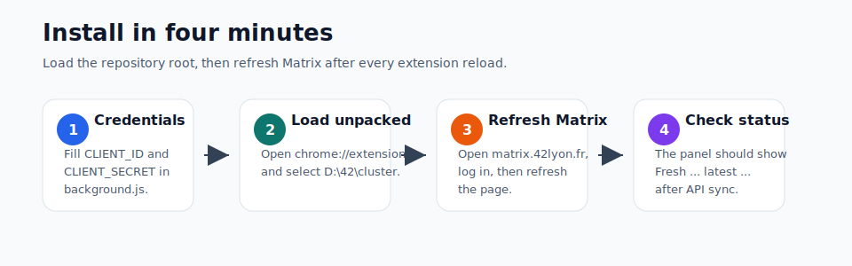
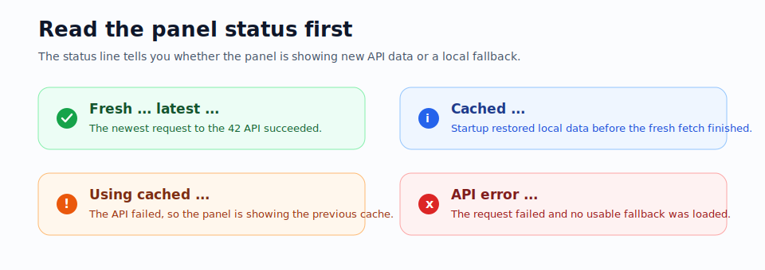

# 42 Cluster Time Tracker

A Chrome extension for the 42 Lyon Matrix page. It reads your 42 API location history, shows recent cluster sessions in a floating Matrix panel, and helps you track the 3h42m target for each workstation.



## What It Does

- Loads historical location records from the 42 API.
- Shows daily session history on the Matrix page.
- Tracks progress toward the 3h42m target per host.
- Highlights available and occupied seats when campus status is available.
- Keeps a local cache so the panel can still show data when the API is temporarily unavailable.
- Offers multiple panel skins from the extension popup.

## Requirements

- Chrome or another Chromium-based browser.
- Access to `https://matrix.42lyon.fr/`.
- A 42 API application with a UID and Secret.

The extension now lives directly at the repository root. When Chrome asks for the unpacked extension folder, select:

```text
D:\42\cluster
```

Do not select the old `D:\42\cluster\extension` folder.

## Setup

1. Open `background.js`.
2. Fill in your 42 API credentials:

```javascript
const CLIENT_ID = 'your UID';
const CLIENT_SECRET = 'your Secret';
```

3. Open Chrome and go to `chrome://extensions/`.
4. Enable Developer mode.
5. Click Load unpacked.
6. Select `D:\42\cluster`.
7. Open `https://matrix.42lyon.fr/` and refresh the page.

After any change to code or credentials, reload the extension in `chrome://extensions/`, then refresh the Matrix page.

## First Run

1. Open the Matrix page.
2. Log in with your 42 account.
3. Wait for the floating panel to appear in the upper-right corner.
4. If your login is not detected automatically, enter your 42 login in the User field and click Get.
5. Check the API status line. A successful fresh fetch should show `Fresh ... latest ...`.



## API Status Guide

The API status line tells you whether the panel is showing fresh API data or fallback cache data:

- `Fresh ... latest ...`: the latest request to the 42 API succeeded.
- `Cached ...`: the panel restored local cached data while starting up.
- `Using cached ... (API: ...)`: the API request failed, so the panel is showing the previous local cache.
- `API error: ...`: the API request failed and no usable fallback was loaded.

If your latest log appears stuck on an old date, first check whether the status says `Fresh` or `Using cached`.

## Troubleshooting

### Chrome says "Manifest file is missing or unreadable"

You selected the wrong folder. Load unpacked must point to the folder that contains `manifest.json`, which is `D:\42\cluster`.

### I changed UID or Secret, but the logs did not update

1. Go to `chrome://extensions/`.
2. Click reload on the extension card.
3. Refresh the Matrix page.
4. Click the API refresh button in the floating panel.
5. Confirm the status changes to `Fresh ...`.

### The API status shows 401 or Token API Error

Check `CLIENT_ID` and `CLIENT_SECRET` in `background.js`. Make sure there are no extra spaces, missing characters, or swapped values.

### The floating panel does not appear

- Confirm you are on `https://matrix.42lyon.fr/`.
- Confirm the extension is enabled.
- Refresh the Matrix page.
- Open DevTools with F12 and check the Console.

## Project Layout

```text
D:\42\cluster
|-- manifest.json              Chrome extension manifest
|-- background.js              42 API token and location requests
|-- injector.js                Injects page scripts and relays messages
|-- content.js                 Matrix page panel and tracking logic
|-- network-interceptor.js     Debug capture helper
|-- popup.html / popup.js      Extension popup
|-- docs/                      README illustrations
|-- icons/                     Extension toolbar icons
`-- skins/                     Panel themes
```

## Security Note

`CLIENT_SECRET` is stored in extension source code, so it is not truly private. Do not commit real credentials to a public repository and do not share screenshots that reveal your secret.
